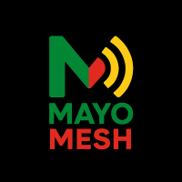

# Welcome!

You’re reading the official welcome page for *Mayo Mesh*, a grassroots user group in County Mayo, Ireland focused on experimenting with peer-to-peer mesh radio networks and building hobby projects on top of them.

---

## Who we are
Mayo Mesh is a friendly, volunteer-run community of hobbyists, radio enthusiasts, makers, coders and curious people who enjoy learning by doing. We are entirely independent and **not affiliated with any commercial organisation**. Our activities are local, community-focused and open to anyone with an interest in mesh radio technology.

## Our purpose
- Experiment with peer-to-peer mesh radio networks (e.g., Meshtastic and similar platforms).
- Build small hobby projects and demos to explore mesh communication capabilities.
- Share knowledge, tools, and best practices in a welcoming, hands-on environment.
- Promote safe, legal, and responsible use of radio spectrum in line with local regulations.

## Getting started — connecting a new device
If you’ve just unboxed your first Meshtastic device, here’s how to get connected to the Mayo Mesh **LongFast** preset:

1. **Update the device**
    - Visit [https://flasher.meshtastic.org/](https://flasher.meshtastic.org) for instructions on how to update your device to the latest firmware.

2. **Install the Meshtastic app**  
   - Download the official Meshtastic app from the [Google Play Store](https://play.google.com/store/apps/details?id=com.geeksville.mesh&hl=en_IE&pli=1) or [Apple App Store](https://apps.apple.com/in/app/meshtastic/id1586432531), or install the desktop app if preferred.

3. **Power up your device**  
   - Connect it via USB to your laptop or charge it if it has a built-in battery. Most devices will power on automatically.

4. **Pair with your device**  
   - In the Meshtastic app, search for your device over Bluetooth or USB. Select it to pair.

5. **Apply the LongFast preset**  
   - Go to **Settings > Radio**.  
   - Select **Region: EU868** (if in Ireland).  
   - Under **Channel settings**, choose the **LongFast** preset.  
   - Save and sync the configuration.

6. **Test your connection**  
   - Send a short text message in the app. If another Mayo Mesh device is nearby, you should see an acknowledgement.

7. **You’re on the mesh!**  
   - From here, you can experiment, join range tests, or link up with other Mayo Mesh members.

If you get stuck, don’t worry — bring your device to a meetup and we’ll help you configure it.

## Responsible & legal operation
Mayo Mesh is committed to operating within all applicable local laws and regulations governing radio spectrum use. That means:
- We will only perform on-air transmissions on frequencies and power levels permitted by Irish regulations and licences where required.
- We will coordinate any community demonstrations in advance and follow best-practice safety steps (appropriate antennas, safe power handling).
- Mayo Mesh is **not** a commercial or commercial-affiliated body and will not engage in paid endorsements.

If you plan to run experiments requiring licensed frequencies or high power, discuss with the group so we can make sure it’s conducted legally.

## Code of conduct
Mayo Mesh aims to be inclusive and respectful. By participating, you agree to:
- Treat everyone with respect, regardless of experience level.
- Share knowledge freely and credit others appropriately.
- Avoid harassment, hateful speech, and disruptive behaviour.
- Follow organisers’ safety instructions during on-site or on-air activities.

## Projects & examples
Members often collaborate on small projects such as:
- Long-range telemetry beacons for weather or environmental sensors.
- Portable personal messaging between hikers during group walks.
- Mesh-linked emergency notifications for remote events (non-commercial and legally compliant).
- Mapping network coverage and performing range studies.

## Resources & Learning
- [Meshtastic project (official docs)](https://meshtastic.org/docs/getting-started/) — great for quick device setup and examples.
- Check out [Liam Cottle's Meshtastic Map](https://meshtastic.liamcottle.net/?lat=53.832230300637704&lng=350.7948303222657&zoom=10) to see if there are any nodes nearby that are sharing data publically.
- If you wish to learn more about other radio experiments within Mayo, visit the [Mayo Radio Experimenters Network](https://www.facebook.com/p/Mayo-Radio-Experimenters-Network-100064833669220/).

---

*Created for Mayo Mesh — a local, volunteer-run mesh radio user group in County Mayo.*